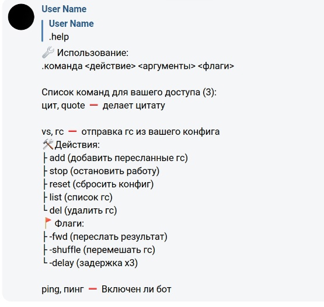
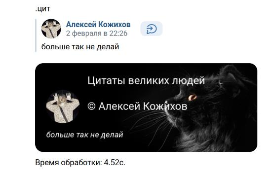

## Установка

1. **Скачать репозиторий**:
   ```bash
   git clone https://github.com/iokiris/vk-mog-bot.git
   cd vk-mog-bot
   ```
2. **Установить зависимости (рекомендуется использовать виртуальное окружение)**:

   ```bash
   python -m venv venv
   ```
   #### Linux
   ```bash
   source venv/bin/activate   # Для Windows: `venv\Scripts\activate`
   pip install -r requirements.txt
   ```
   
3. **Настроить конфиг**: отредактируйте settings/config.py файл в соответствии с вашими настройками.
   ```python
   # settings/config.py
   TOKEN = ""
   QUOTE_TITLE_MESSAGE = "Цитаты великих людей"
   MAX_VOICE_COUNT = 15  # ограничение кол-ва сохраненных голосовых сообщений для voice-sender на одного человека
   ```

4. **Запуск**:
   ```bash
   python main.py
   ```


## Скриншоты

* #### Просмотр списка команд
<p align="center">
  
</p>

* #### Цитаты
<p align="center">
  
</p>

* #### Голосовые сообщения
<p align="center">
  
</p>